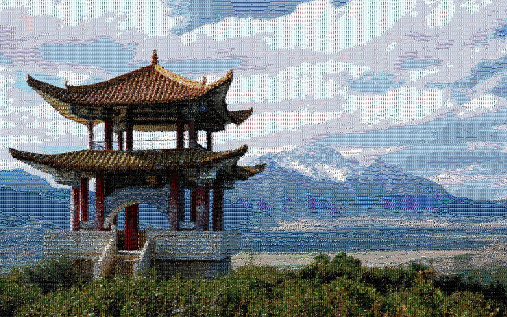

# Mosaic
A simple python implementation that creates a mosaic image.

Images are converted to list of lists, no fancy libraries or slice notations are used.

```bash
Usage: 
  python3 mosaic.py <image_source> <images_dir> <output_name> <tile_height> <num_candidates>
```

Tiles are resized to have height=<tile_height>

The script was run on the following image


Running the following command
```bash
python3 mosaic.py image.jpg images output_image.jpg 7 3
```
yields




While running the following command (with a larger tile_height)
```bash
python3 mosaic.py image.jpg images output_image.jpg 15 3
```
yields


